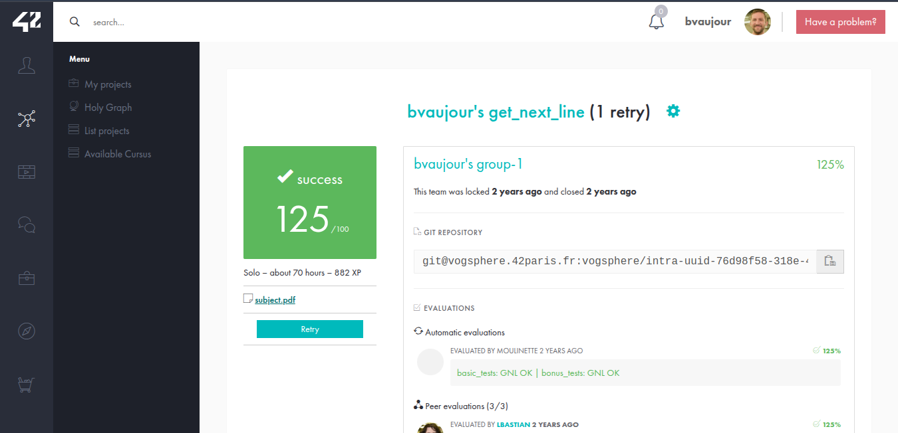

# Get Next Line
[Voir le sujet](./fr.subject.pdf)

Projet de niveau 2 de l'école 42.

Implémentation d’une fonction permettant de lire un fichier ligne par ligne, en gérant un buffer de taille variable.

